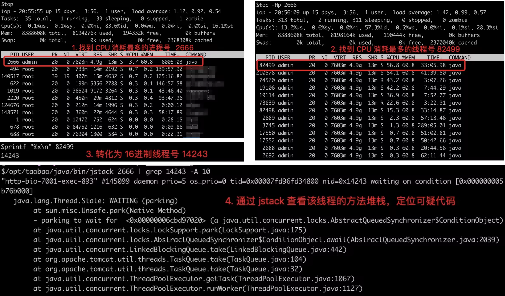
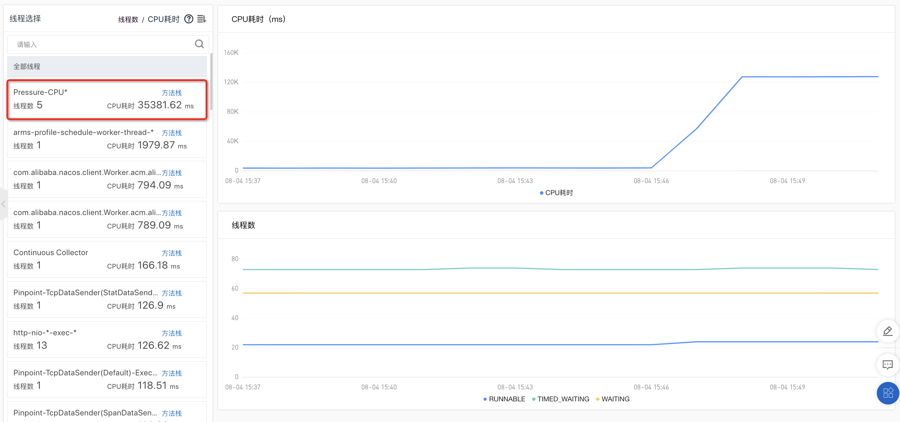
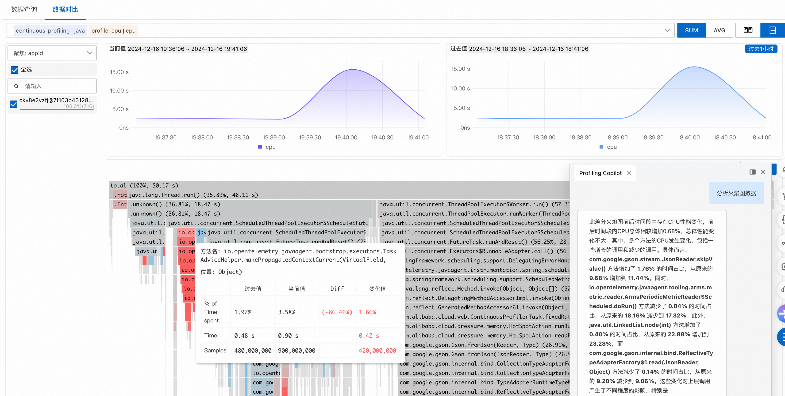
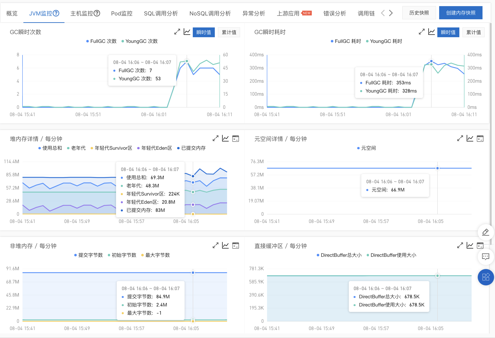
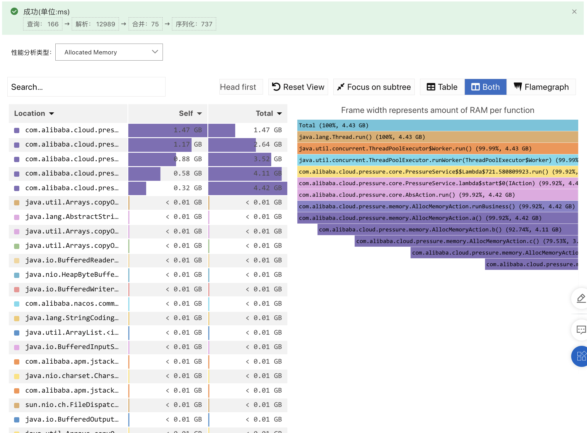
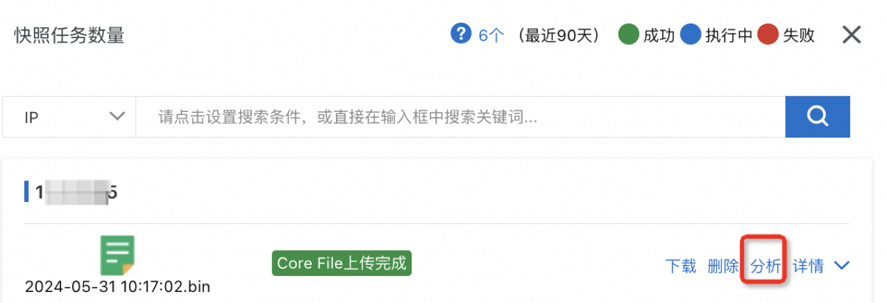
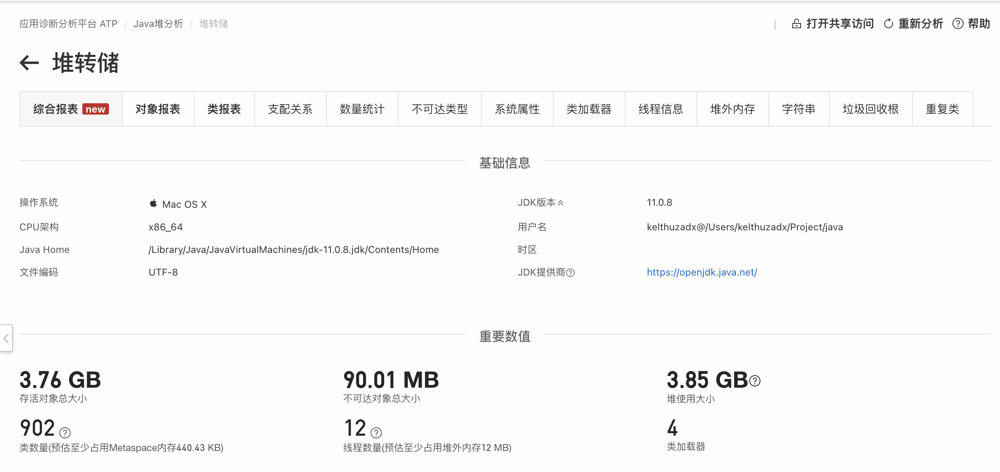

# Java 应用 CPU & JVM 内存性能调优

> 作者：夏明（涯海）    
> 创作日期：2024-12-20  
> 专栏地址：[【稳定大于一切】](https://github.com/StabilityMan/StabilityGuide)

双十一大促前夕，部门组织了核心应用全链路压测，你负责的订单中心在第一波压测流量脉冲下 CPU 利用率瞬间飙升到 95% 以上，接口调用大量超时，成为全链路卡点，最终导致压测活动草草结束，主管责令限期1天解决，该如何快速定位 CPU 性能瓶颈完成优化？

熬夜爆肝写了2千行代码，终于赶在项目截止日期前完成线上发布，没等你美美的喝完一瓶冰可乐，手机就开始滴滴的响个不停，告警电话如雨后春笋般接踵而至，JVM 内存持续 FGC，请求超时流量下跌，面对领导和客户的催促，该如何快速定位内存性能瓶颈解决风险？

以上场景对于参与 Java 应用研发或运维的同学来说，相信都不陌生。CPU 和 JVM 内存是 Java 应用的核心资源，一旦出现热点导致资源不足，很容易引发大面积故障。因此，掌握高效的 CPU 与 JVM 内存性能优化手段就显得尤为重要。

## CPU 性能优化实战

CPU（Central Processing Unit）是计算机系统的运算和控制核心，是信息处理、程序运行的最终执行单元，相当于系统的“大脑”。当 CPU 过于繁忙，就像“人脑”并发处理过多的事情，会降低做事的效率，严重时甚至会导致崩溃“宕机”。因此，合理控制 CPU 的负载，是保障系统稳定持续运行的重要手段。

CPU 使用率是 CPU 非空闲态运行的时间占比，它反映了 CPU 的繁忙程度。比如，单核 CPU 1s 内非空闲态运行时间为 0.8s，那么它的 CPU 使用率就是 80%；双核 CPU 1s 内非空闲态运行时间分别为 0.4s 和 0.6s，那么，总体 CPU 使用率就是 `(0.4s + 0.6s) / (1s * 2) = 50%`，其中 2 表示 CPU 核数，多核 CPU 同理。根据经验法则， **建议生产系统的 CPU 总使用率不要超过 70%。**

CPU 使用率只反映系统健康状态的度量指标，并不是问题的根因。因此，它的价值主要体现在两个方面： 一是综合反映当前系统的健康程度，结合监控告警产品，实现快速响应；二是初步定界问题方向，缩小排查范围，降低故障恢复时间。 比如当 CPU iowait 高时，应优先排查磁盘 I/O；当 CPU steal 高时，就优先排查宿主机状态。CPU 涵盖的问题场景有很多，限于篇幅限制，下面以最常见的用户态 CPU 使用率高为例，介绍下 Java 应用的排查思路。

### 如何排查用户态 CPU 使用率高？

用户态 CPU 使用率反映了应用程序的繁忙程度，通常与我们自己写的代码息息相关。因此，当你在做应用发布、配置变更或性能优化时，如果想定位消耗 CPU 最多的 Java 代码，可以遵循如下思路：

1.  通过 `top` 命令找到 CPU 消耗最多的进程号；

2.  通过 `top -Hp 进程号` 命令找到 CPU 消耗最多的线程号（列名仍然为 PID）；

3.  通过 `printf "%x\n" 线程号` 命令输出该线程号对应的 16 进制数字；

4.  通过 `jstack 进程号 | grep 16进制线程号 -A 10` 命令找到 CPU 消耗最多的线程方法堆栈。

上述方法是目前业界常用的诊断流程，然而该方法有两个显著缺陷，一是操作流程复杂，而且往往一次 jstack 还不足以定位根因，需要执行多次；二是只能用于诊断在线问题，无法记录历史快照，如果问题已经发生，无法复现的话，往往只能不了了之。

为了解决上述问题，业界领先的 APM 产品已经支持了常态化记录线程/方法栈 CPU开销的持续剖析能力，随时回溯历史快照，对比不同时段的 CPU 热点变化。以阿里云 ARMS 产品为例，典型的 CPU 热点排查思路主要分为以下几步：

1.  通过主机/Pod CPU 利用率监控或告警，第一时间发现 CPU 利用率异常飙升现象。  
	

2.  通过线程分析监控，快速找到 CPU 消耗最高的线程池，比如 Pressure-CPU\*。  
	

3.  通过持续剖析-CPU热点功能，回溯任意时间段内的 CPU 占比火焰图，直接定位到性能瓶颈方法，比如下图中 CPUPressure.runBusiness( ) 方法的 CPU 开销占比高达 99.7%，研发同学定位到具体的业务代码行，就可以快速优化代码解决 CPU 热点问题。  
	

4.  生产系统的方法调用栈更加复杂，ARMS 还支持差分火焰图直观对比不同时间段的 CPU 开销变化，比如应用发布、大促压测等场景，再结合 Copilot 智能诊断给出影响 CPU 变化的关键方法，无需丰富的专家经验也能轻松完成性能优化工作，如下图所示。  
	

## JVM 内存性能优化实战

内存（Memory），作为计算机系统中的关键组成部分，不仅影响着程序运行的速度，还决定了多任务处理的能力以及数据访问的效率。从本质上讲，内存是一种临时存储介质，用于存放正在执行的程序及其相关数据，以便CPU能够快速访问。相比于硬盘等长期存储设备，内存具有更高的读写速度，但其容量相对较小且断电后信息会丢失。因此，在计算机体系结构中，合理配置与优化使用内存资源显得尤为重要。

JVM 的内存主要分为堆（Heap）、栈（Stack）、方法区（Method Area）等几个部分。其中，堆用于存放对象实例，而栈则存储了方法调用过程中产生的局部变量及操作数栈等信息。方法区主要用于保存类结构信息如运行时常量池等。其中，堆区域是最容易产生内存热点的地方，因为它直接关联着对象生命周期管理和垃圾收集活动。当 JVM 内存严重不足时，就会抛出 java.lang.OutOfMemoryError 错误，常见的 OOM 类型如下图所示。

### JVM 内存热点成因分析

常见的 JVM 内存热点产生原因主要包括以下几类，每种原因背后都隐藏着复杂的机制。

1.  **对象创建过于频繁**：如果存在大量短生命周期的对象被频繁地创建与销毁，这将导致垃圾回收器（Garbage Collector, GC）频繁工作以清理不再使用的对象空间。这种情况下，即使GC算法本身效率很高，但由于其执行频率过高，仍然会对系统性能造成显著影响。例如，在循环体内部创建临时变量而不进行复用。为了缓解这一问题，可以考虑使用对象池技术或尽量减少不必要的对象实例化操作。还有一种情况是上游系统请求流量飙升，常见于各类促销/秒杀活动，此时可以考虑添加机器资源，或者做限流降级。

2.  **大对象分配**：当应用程序中申请大对象时（如大型数组），通常会被直接分配到老年代而非新生代区域。虽然这样做可以避免短期内因这些大对象而触发 YoungGC，但如果此类对象数量较多，则可能会迅速填满老年代空间，进而迫使Full GC发生。Full GC会暂停所有用户线程并扫描整个堆区，因此对应用性能的影响尤为严重。针对这种情况，建议评估是否真的需要如此大的数据结构，并探索更高效的数据表示方式。

3.  **内存泄漏**：尽管Java具有自动内存管理功能，但不当的设计模式或编程习惯仍可能导致内存泄露问题。比如，静态集合类持有外部引用、未关闭的数据库连接等都是常见场景。随着时间推移，这些无法被正常回收的对象逐渐积累起来，最终耗尽可用堆空间。解决之道，首先通过一些监控分析工具定界不断增长的内存位置来源，判断内存泄露是发生在堆内还是堆外，如果是堆内可以借助诸如jmap等工具下载内存快照，检查堆内占比高的内存对象，并结合代码分析根因。如果是堆外部分出现了内存稳定增长，此时需要借助一些外部诊断工具，比如 NMT（[Native Memory Tracking](https://docs.oracle.com/javase/8/docs/technotes/guides/troubleshoot/tooldescr007.html#BABJGHDB)）等对堆外内存申请情况进行监测，分析可能的原因。

4.  **不合理的堆大小设置**：JVM启动参数中的-Xms（初始堆大小）和-Xmx（最大堆大小）对于控制内存使用至关重要。如果这两个值设置得过低，则可能因为频繁的GC活动而降低程序性能；反之，若设定得过高，则又会浪费宝贵的物理内存资源。理想状态下，应根据实际业务需求及硬件配置情况合理调整这两个参数，一般设置为总内存大小的1/2左右，然后留1/2给非堆部分使用。此外，-XX:NewRatio等选项的设置也很重要，需要基于其去平衡新生代与老年代的比例关系，从而达到最佳性能状态。

5.  **加载的 class 数目太多或体积太大**：永久代（Permanent Generation，JDK 1.8 使用 Metaspace 替换）的使用量与加载到内存的 class 的数量/大小正相关。当加载的 class 数目太多或体积太大时，会导致 永久代用满，从而导致内存溢出报错。可以通过 -XX:MaxMetaspaceSize / -XX:MaxPermSize 上调永久代大小。

### 如何排查 JVM 内存热点问题？

生产环境需要常态化跟踪 JVM 内存变化，如何第一时间发现 JVM 内存问题，并快速定位止血，整体思路与 CPU 热点优化类似，主要包括以下步骤：

1.  通过 JVM 监控/告警发现内存或 GC 异常，分析新生代、老年代、Metaspace、DirectBuffer 等内存变化。  
	
2.  通过持续剖析-内存热点功能，常态化记录每个方法的内存对象分配占比火焰图，比如下图中AllocMemoryAction.runBusiness() 方法消耗了 99.92% 的内存对象分配。
	
3.  内存快照记录了相关时刻的堆内存对象占用和进程类加载等信息。阿里云 ARMS 提供了一种开箱即用的内存快照白屏化操作功能，让快照创建、获取和分析更加简单便捷。结合阿里云 ATP 分析工具，实现了 JVM 内存对象与引用关系的深入分析和诊断。  
	  
	

## 小结

本文介绍了 Java 应用常见的 CPU & JVM 内存热点原因及优化思路，首先通过监控告警及时发现资源使用率的异动，然后结合方法级别的 CPU/内存火焰图定位热点代码，帮忙研发同学快速排障，优化系统资源使用，确保应用在高负载下的稳定运行。

## 推荐产品
- [阿里云 ARMS 应用监控](https://help.aliyun.com/product/34364.html)

## 推荐社区
【稳定大于一切】打造国内稳定性领域知识库，**让无法解决的问题少一点点，让世界的确定性多一点点。**

- GitHub 专栏地址：[https://github.com/StabilityMan/StabilityGuide](https://github.com/StabilityMan/StabilityGuide)
- 微信公众号：万物可观测
- 钉钉交流群号：30000312
- 如果阅读本文有所收获，欢迎分享给身边的朋友，期待更多同学的加入！

